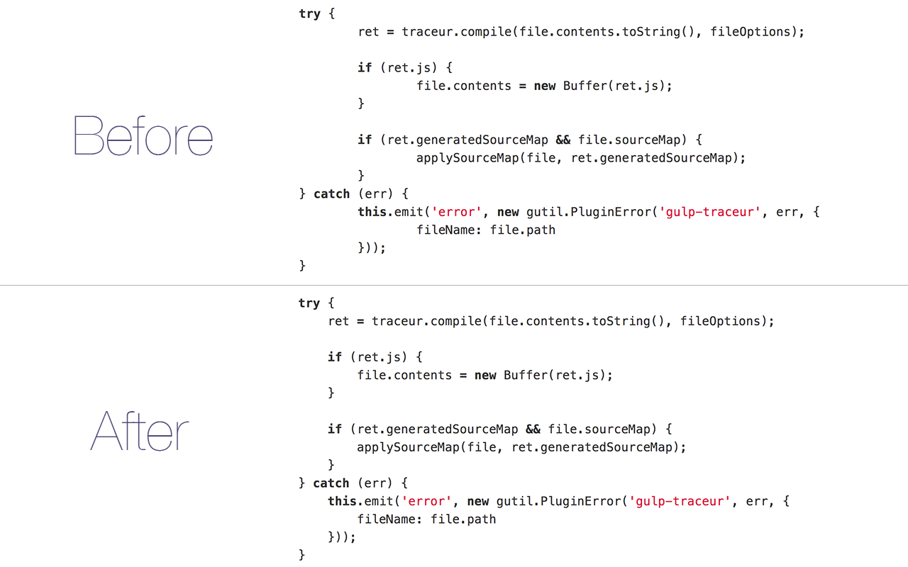

# Tab Size on GitHub

> Chrome extension - Make tab indented code more readable by forcing the tab size to <strike>4</strike> 2 instead of 8

It's intentionally simple and I'm not interested in adding anything more to it.

## Install

Install it [manually](http://superuser.com/a/247654/6877).

## License

MIT © [Sindre Sorhus](https://sindresorhus.com), modified for 2 tabs by [Ajit Panigrahi](https://ajitpanigrahi.com)
